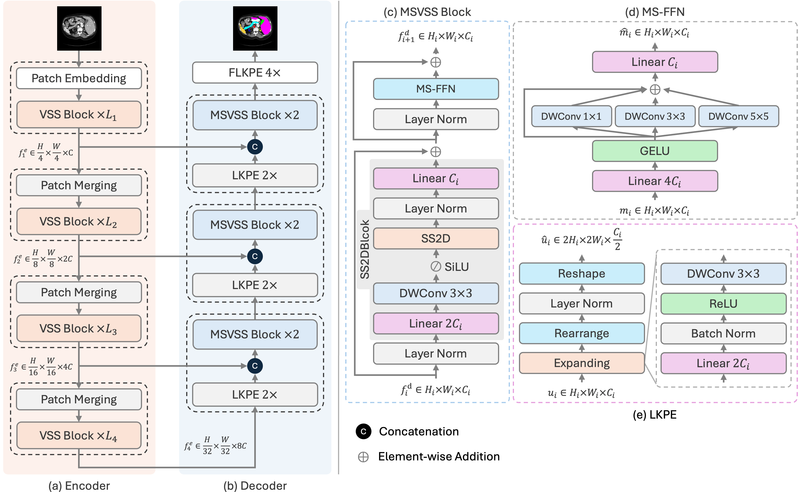
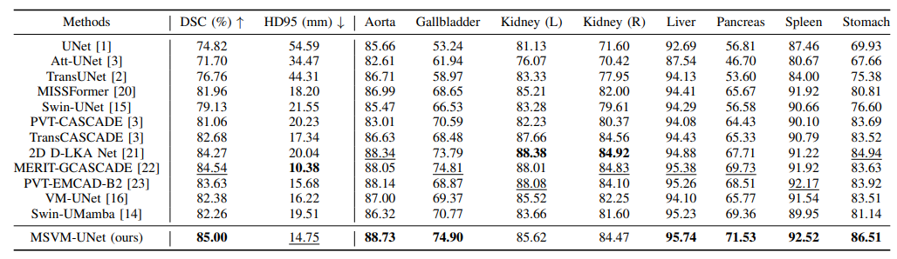
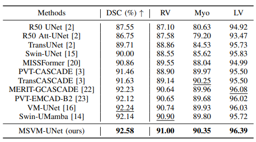

<div align="center">
<h1>MSVM-UNet: Multi-Scale Vision Mamba UNet for Medical Image Segmentation</h1>

[Chaowei Chen](mailto:chishengchen@stu.ynu.edu.cn)<sup>1</sup>,[Li Yu](mailto:yuli0501@163.com)<sup>1</sup>,[Shiquan Min](mailto:minshiquan@mail.ynu.edu.cn)<sup>1</sup>, [Shunfang Wang](mailto:sfwang_66@ynu.edu.cn)<sup>1,2,*</sup>

<div><sup>1</sup>School of Information Science and Engineering, Yunnan University, Kunming, 650504, Yunnan, China</div>
<div><sup>2</sup>Yunnan Key Laboratory of Intelligent Systems and Computing, Yunnan University, Kunming, 650504, Yunnan, China</div>

Paper: ([arXiv 2408.13735](https://arxiv.org/abs/2408.13735))

</div>

## Abstract

State Space Models (SSMs), especially Mamba, have shown great promise in medical image segmentation due to their ability to model long-range dependencies with linear computational complexity. However, accurate medical image segmentation requires the effective learning of both multi-scale detailed feature representations and global contextual dependencies. Although existing works have attempted to address this issue by integrating CNNs and SSMs to leverage their respective strengths, they have not designed specialized modules to effectively capture multi-scale feature representations, nor have they adequately addressed the directional sensitivity problem when applying Mamba to 2D image data. To overcome these limitations, we propose a Multi-Scale Vision Mamba UNet model for medical image segmentation, termed MSVM-UNet. Specifically, by introducing multi-scale convolutions in the VSS blocks, we can more effectively capture and aggregate multi-scale feature representations from the hierarchical features of the VMamba encoder and better handle 2D visual data. Additionally, the large kernel patch expanding (LKPE) layers achieve more efficient upsampling of feature maps by simultaneously integrating spatial and channel information. Extensive experiments on the Synapse and ACDC datasets demonstrate that our approach is more effective than some state-of-the-art methods in capturing and aggregating multi-scale feature representations and modeling long-range dependencies between pixels.

## Overview



## Main Results

- Synapse Multi-Organ Segmentation



- ACDC for Automated Cardiac Segmentation



## Installation

We recommend the following platforms: 

```
Python 3.8 / Pytorch 2.0.0 / NVIDIA GeForce RTX 3090 / CUDA 11.8.0 / Ubuntu
```

In addition, you need to install the necessary packages using the following instructions:

```bash
pip install -r requirements.txt
```

And install a runtime environment that supports Mamba:

```bash
cd ./kernels/selective_scan
pip install -e .
```

## Prepare data & Pretrained model

#### Dataset:

- **Synapse Multi-Organ Dataset**: Sign up in the [official Synapse website](https://www.synapse.org/#!Synapse:syn3193805/wiki/89480) and download the dataset or download the [preprocessed data](https://drive.google.com/file/d/1tGqMx-E4QZpSg2HQbVq5W3KSTHSG0hjK/view?usp=share_link) and save in the `dataset/synapse/` folder.
- **ACDC Dataset**: Download the preprocessed ACDC dataset from [Google Drive of MT-UNet](https://drive.google.com/file/d/13qYHNIWTIBzwyFgScORL2RFd002vrPF2/view) and move into `dataset/acdc/` folder.

#### ImageNet pretrained model:

You should download the pretrained VMamba-Tiny V2 model (vssm_tiny_0230_ckpt_epoch_262) from [VMamba](https://github.com/MzeroMiko/VMamba/releases/download/%23v2cls/vssm_tiny_0230_ckpt_epoch_262.pth), and then put it in the `model/pretrain/` folder for initialization.

## Training

Using the following command to train & evaluate MSVM-UNet:

```python
# Synapse Multi-Organ Dataset
python train_synapse.py
# ACDC Dataset
python train_acdc.py
```

## Citation

```
@article{chen2024msvmunet,
  title={MSVM-UNet: Multi-Scale Vision Mamba UNet for Medical Image Segmentation}, 
  author={Chaowei Chen and Li Yu and Shiquan Min and Shunfang Wang},
  journal={arXiv preprint arXiv:2408.13735},
  year={2024}
}
```

## Acknowledgements

We thank the authors of [TransUNet](https://github.com/Beckschen/TransUNet), [SLDGroup](https://github.com/SLDGroup), [Mamba](https://github.com/state-spaces/mamba), [VMamba](https://github.com/MzeroMiko/VMamba), [VM-UNet](https://github.com/JCruan519/VM-UNet), and [Swin-UMamba](https://github.com/JiarunLiu/Swin-UMamba) for making their valuable code & data publicly available.
